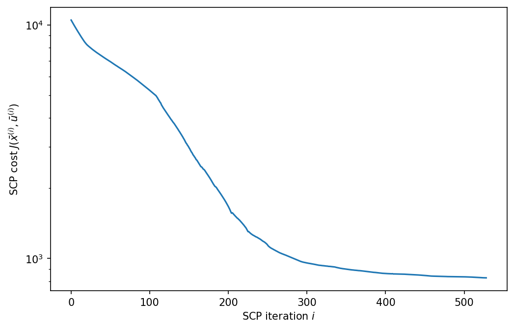
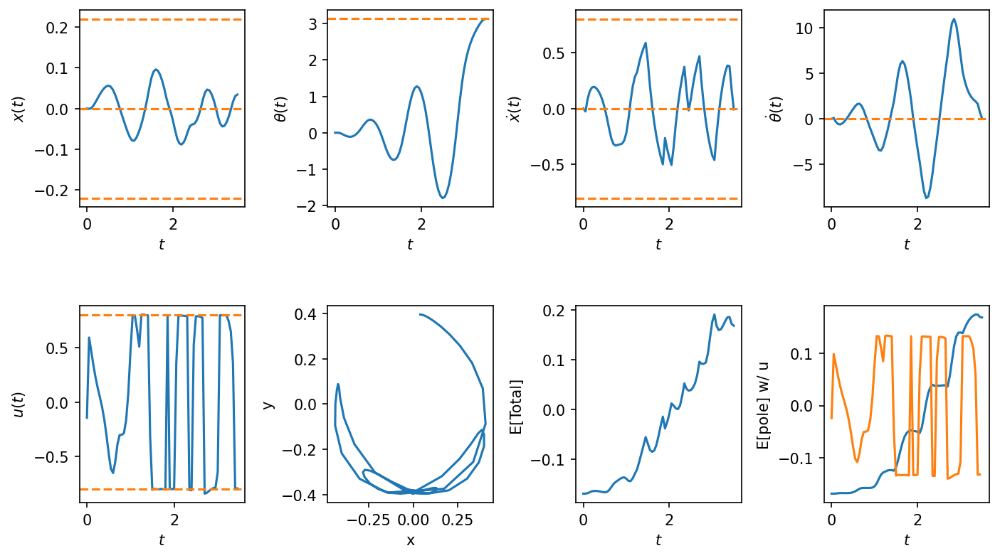
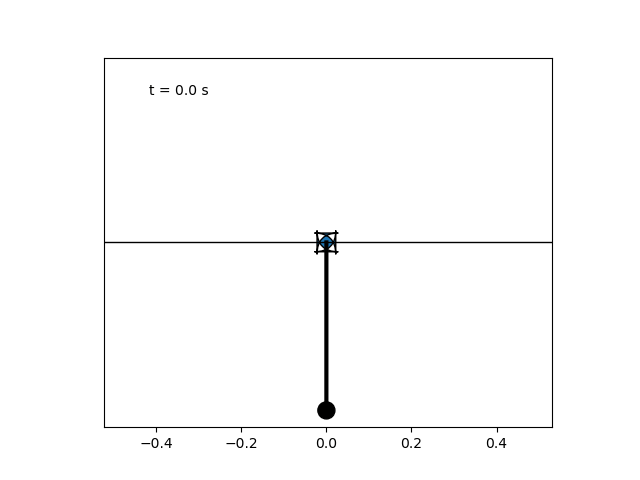
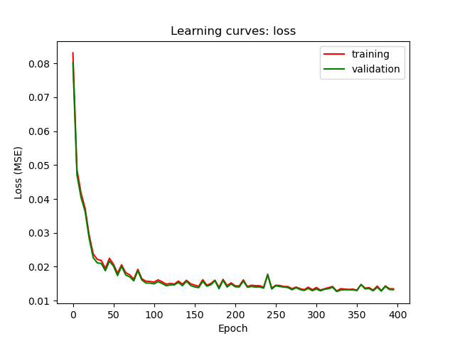
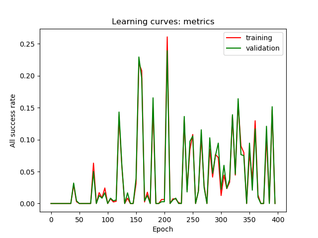
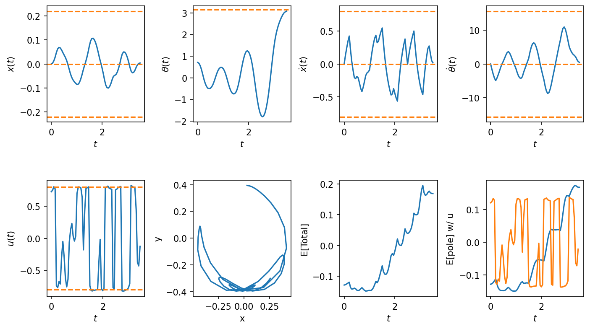
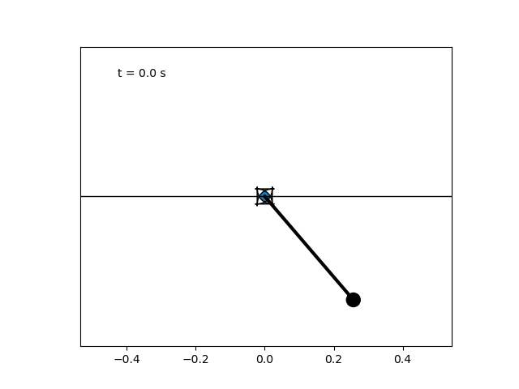

# Trajectory Utils (work in progress!)

Tools for computing or manipulating trajectories for robotics or control systems.

## Installation

This code has been targeted to run on top of ROS2 Humble. An example would be running a trajectory solver from within a ROS2 node. Current procedure is to use a virtual env, which can safely extend your ROS2 Humble installation. This repo was developed and used on linux platforms running python 3.10.12 (the version supported by ROS2 Humble).

A makefile is included with useful targets, to be run from the ```torch``` directory, e.g.:

```
make setup-cu124
make check
```

And finally, 

```
source venv/bin/activate
```

You should see that your shell is in the ```ros2-ml``` venv after these steps. Even if you are not using ros2! :)

## Contents

An SCP (Sequential Convex Programming) control trajectory solver for a differential drive robot:

```
diff_drive_solver.py
run_diff_drive.py
```

An SCP trajectory solver for a cartpole (with a particular physical twin - more to come) driven by force on the pole hub (a belt driven "cart"):

```
cartpole_solver_force.py
run_cartpole_force.py
```

An SCP trajectory solver for a cartpole (with a particular physical twin - more to come) driven by a velocity servo on the pole hub (a belt driven "cart"):

```
cartpole_solver_velocity.py
run_cartpole_velocity.py
```

# Sequential Convex Programming (SCP)

SCP solvers are generalized via polymorphism in:

```
scp_solver.py
```

SCP solvers define a subclass of SCPSolver. Current examples are CartpoleSolverVelocity, CartpoleSolverForce and DiffDriveSolver (see the Contents section). These solvers use cvxpy and pytorch. These solvers are based on principles and examples covered in Optimal Control (e.g., Stanford AA203, Optimal and Learning-based Control).

# Robot control trajectory solutions

When collecting data to observe sensor data (e.g., IMU and odometry) under robot actions, it would be useful to have a method to compute control trajectories which satisfy some nominal control strategy, but are also unlikely to cause the robot to collide with obstacles. Optimal control to the rescue! Code in:

```
run_diff_drive.py
scalar_field_interpolator.py
diff_drive_solver.py
```

generates an occupancy map of a 2x3m open area with a point obstacle. The class ```ScalarFieldInterpolator``` uses pytorch to generate a differentiable signed distance function (SDF) of the map which serves as an obstacle constraint for our trajectory solver. This class can be easily used to generate an SDF of any obstacle map (e.g, a ROS2 occupancy map). The script ```run_diff_drive.py``` produces a trajectory which starts at the current robot location, but with any initial heading (the robot can turn to this heading first).

Minimized cost, states and actions computed by this script are:

 

An overlay of the computed trajectory and the SDF is:


# Cartpole solutions

See [writeup/math_background.pdf](writeup/math_background.pdf) for more detail.

Solutions for the "swing-up" of a cartpole from a stationary unmoving pendulum are shown below. These solutions model a cartpole system where the pendulum is a rod attached to a pivot in the center of a belt-driven "cart". (More details to come). This system differs somewhat from typical textbook examples where the pendulum mass is concentrated at the end of the pendulum.

## Cart force control

The system could in principle be driven by a force on the cart. A solution to swing-up is produced by executing ```run_cartpole_force.py```.

Minimized cost, states and actions computed by this script are:

 

An animation of the cartpole is:


## Cart velocity control

The system could also be driven by a velocity servo on the cart. A solution to swing-up is produced by executing ```run_cartpole_velocity.py```.

Minimized cost, states and actions computed by this script are:

 

An animation of the cartpole is:



## Cart Neural Network control

One of the intents of this work is to train a neural network to reproduce the wisdom of the trajectory solvers. Then, we make these networks run really fast (more to come). A typical pytorch/cvxpy solve requires at least 20-30 seconds - so could only be used to produce open-loop control trajectories. A first cut at imitation (supervised) learning of the controller is implemented in:

```
generate_trajectories.py
assess_trajectories.py
trajectory_loader.py
train.py
predict.py
```

Training checkpoints are included for 32=bit and 64-bit pytorch models. See:
```
train/trajectories_big_1_32
train/trajectories_big_1_64
```

These are generated via obvious manipulations of the arguments to train() in ```train.py```.

An example of learning curves (for the 32-bit model) from an 80/20 data split follows. First, loss:



Then metrics:



The metrics indicate the challenge of training a NN controller by fitting flattened state-control pairs (more to come).

The  input data for this model training was generated from "expert" solves from random (but stationary) starts of the pendulum in the range of +/- 45 degrees from pointing down. The expert was the velocity servo model of the cartpole (see above). The resulting training data consists of 3598 3.5 second successful swingups.

A median quality goal rollout from the "best" model (epoch 205) is:



The animation of this rollout is:



For this test particular test, the NN seems to have nailed the controller. But, in general the model is insufficient. According to the metrics, only around 25% of the sampled trajectories satisfied limits on goals and constraints.

The current training process DOES NOT YET include expert trajectories based on rollouts of the model being trained (_a la_ DAgger, for example). Also, I have not tuned the model, the datasets, etc. First cut!
