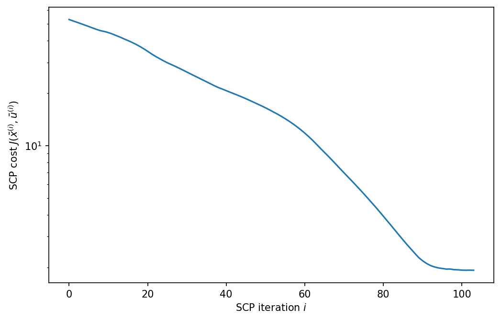
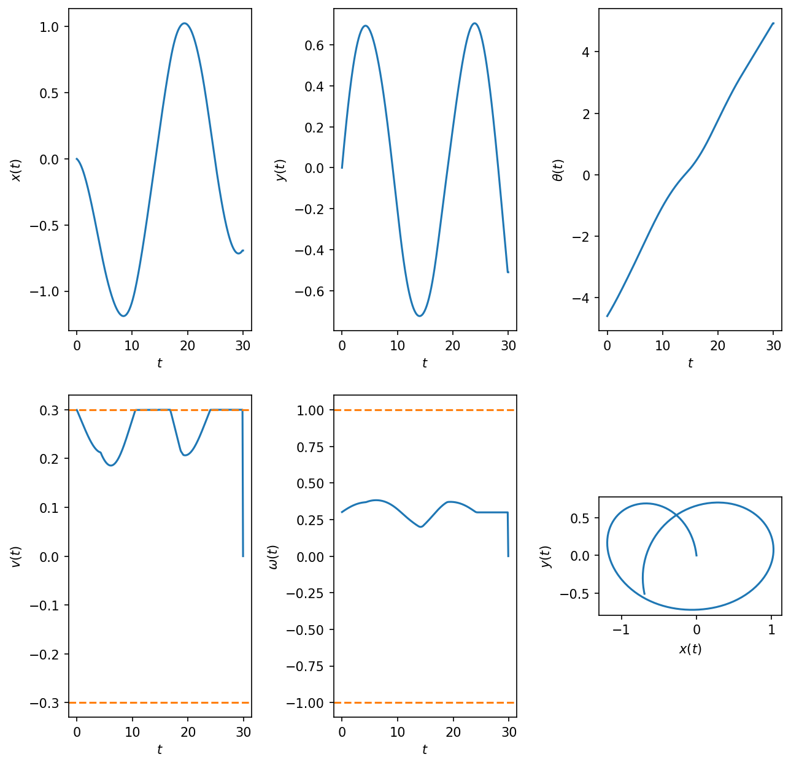
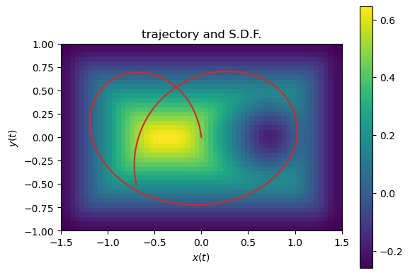
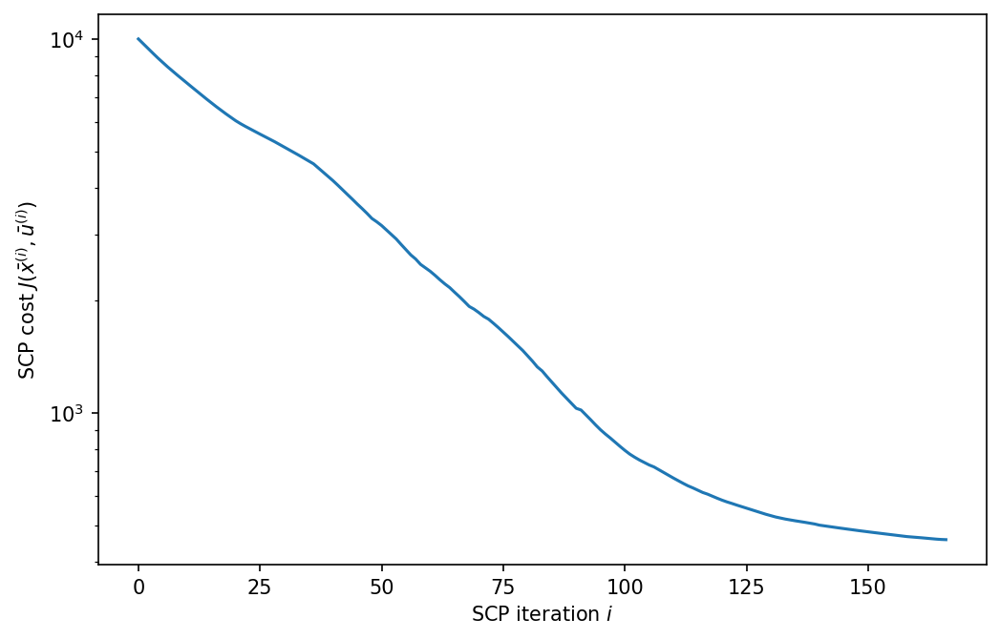
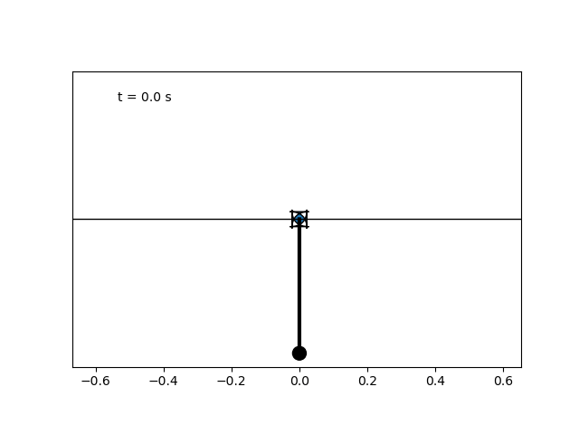
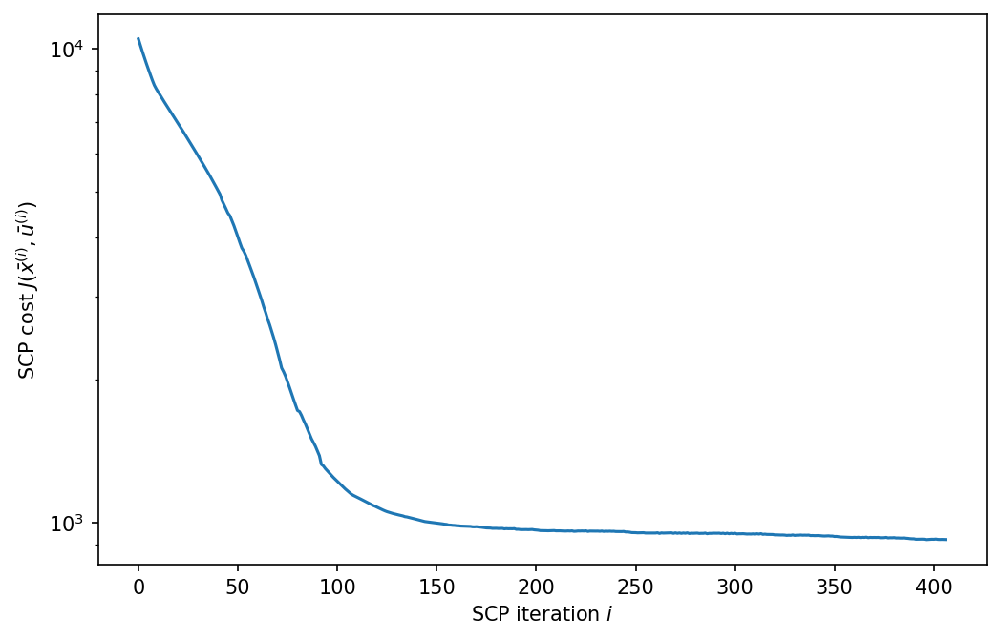
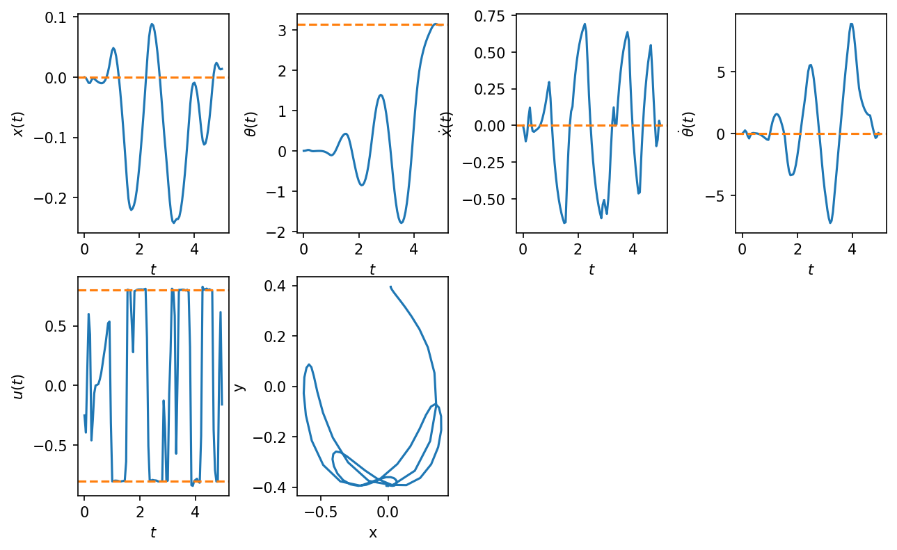
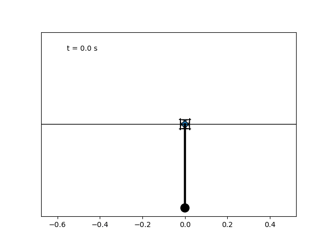

# Trajectory Utils (work in progress!)

Code herein provides tools for computing or manipulating trajectories for robotics or control systems.

## Installation

This code is intended to run on top of ROS2 Humble. An example would be running a trajectory solver from within a ROS2 node. Current procedure is to use a virtual env, which can safely extend your ROS2 humble installation.

A makefile is included with useful targets, to be run from this directory:

```
make setup-cu124
make check
make activate
```

You should see that your shell is in the ```ros2-ml``` venv after these steps. Less manual/experimental support of ROS2+pytorch would seem desirable.

## Contents

An SCP (Sequential Convex Programming) control trajectory solver for a differential drive robot:

```
diff_drive_solver.py
run_diff_drive.py
```

An SCP trajectory solver for a cartpole (with a particular physical twin - more to come) driven by force on the pole hub (a belt driven "cart"):

```
cartpole_solver_force.py
run_cartpole_force.py
```

An SCP trajectory solver for a cartpole (with a particular physical twin - more to come) driven by a velocity servo on the pole hub (a belt driven "cart"):

```
cartpole_solver_velocity.py
run_cartpole_velocity.py
```

# Sequential Convex Programming (SCP)

SCP solvers are generalized via polymorphism in:

```
scp_solver.py
```

SCP solvers define a subclass of SCPSolver. Current examples are CartpoleSolverVelocity, CartpoleSolverForce and DiffDriveSolver (see the Contents section). These solvers use cvxpy and pytorch. These solvers are based on principles and examples covered in Optimal Control (e.g., AA203, Optimal and Learning-based Control).

# Robot control trajectory solutions

See ["writeup/math_background.pdf"]("writeup/math_background.pdf") for more detail.

When collecting data to observe sensor data (e.g., IMU and odometry) under robot actions, it would be useful to have a method to compute control trajectories which satisfy some nominal control strategy, but are also unlikely to cause the robot to collide with obstacles. Optimal control to the rescue! Code in:

```
run_diff_drive.py
scalar_field_interpolator.py
diff_drive_solver.py
```

generates an occupancy map of a 2x3m open area with a point obstacle. The class ```ScalarFieldInterpolator``` uses pytorch to generate a differentiable signed distance function (SDF) of the map which serves as an obstacle constraint for our trajectory solver. This class can be easily used to generate an SDF of any obstacle map (e.g, a ROS2 occupancy map). The script ```run_diff_drive.py``` produces a trajectory which starts at the current robot location, but with any initial heading (the robot can turn to this heading first).

Minimized cost, states and actions computed by this script are:

 

An overlay of the computed trajectory and the SDF is:



# Cartpole solutions

See ["writeup/math_background.pdf"]("writeup/math_background.pdf") for more detail.

Solutions for the "swing-up" of a cartpole from a stationary unmoving pendulum are shown below. These solutions model a cartpole system where the pendulum is a rod attached to a pivot in the center of a belt-driven "cart". (More details to come). This system differs somewhat from typical textbook examples where the pendulum mass is concentrated at the end of the pendulum.

## Cart force control

The system could in principle be driven by a force on the cart. A solution to swing-up is produced by executing ```run_cartpole_force.py```.

Minimized cost, states and actions computed by this script are:

 

An animation of the cartpole is:



## Cart velocity control

The system could also be driven by a velocity servo on the pole. A solution to swing-up is produced by executing ```run_cartpole_velocity.py```.

Minimized cost, states and actions computed by this script are:

 

An animation of the cartpole is:


